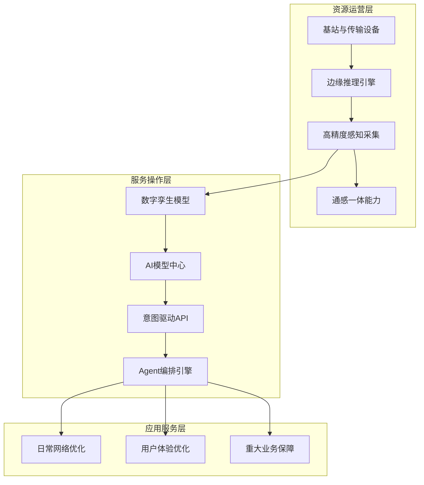
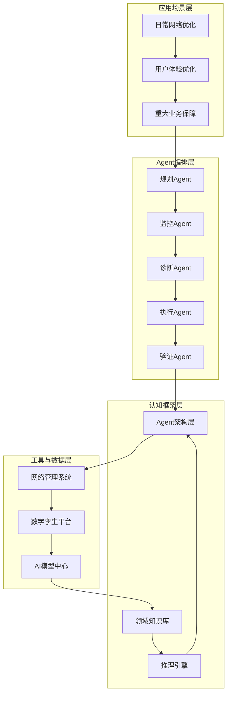
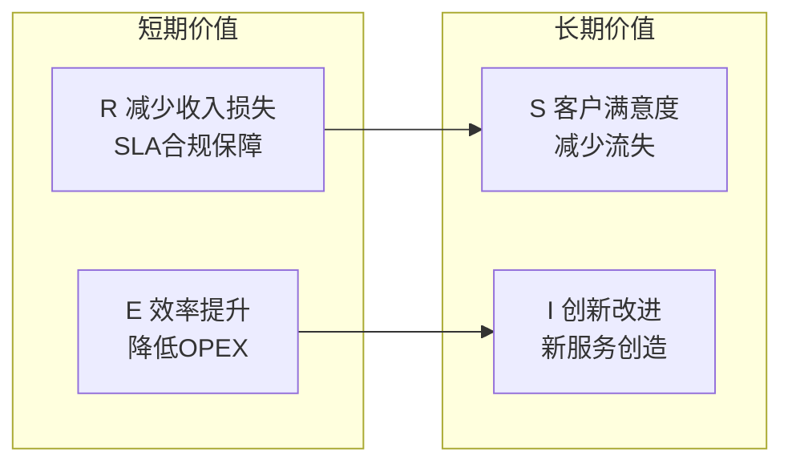

# 未来网络演进白皮书 — 数智分册 R4.0

---

## 封面

**未来网络演进白皮书**

**数智分册 R4.0**

---

---

## 版本更新说明

| 产品版本 | 资料版本 | 资料编号 | 资料更新说明 |
|----------|----------|----------|-------------|
|          | R3.0     |          | 第一次发布 |
|          | R4.0     |          | 增补AI Agent与AgentOps演进体系、数字孪生6G标准化进展、MCP与A2A接口协议、5G-A商用部署数据、ITU IMT-2030框架，更新三大运营商大模型与智算平台最新进展 |

## 作者信息

| 资料版本 | 日期       | 作者 | 审核者 | 批准者 |
|----------|-----------|------|--------|--------|
| V1.0     | 2026-06-30 |      |        |        |

## 适用对象

本白皮书适用于电信运营商网络规划与运维管理人员、通信设备制造商技术人员、通信行业标准研究机构专家，以及关注自智网络、AI Agent和数字孪生技术在通信领域应用的高校和科研院所研究人员。

---

## 摘要

全球数字经济持续高速增长，通信运营商正处于从传统连接提供者向智能服务使能者转型的关键窗口期。截至2025年底，中国已建成5G基站483.8万个，5G用户突破12亿，5G-A商用网络覆盖超过300个城市。与此同时，3GPP Release 19正式完成，ITU IMT-2030技术性能要求草案达成共识，6G标准化进程全面提速。在技术融合层面，AI Agent正从单点应用走向多智能体协同运营，超过50%的运营商已在生产环境部署AI代理，AgentOps作为新兴运营方法论正在形成产业共识。数字孪生技术从辅助工具演变为网络全生命周期管理的核心引擎，IEEE INFOCOM 2025和ICC 2025均设立数字孪生专题研讨会，NVIDIA发布面向6G的数字孪生开发者工具套件。GSMA OpenGateway已覆盖85个国家300余个移动网络，MCP和A2A协议为AI代理与网络能力的标准化对接奠定了基础。

本白皮书在R3.0版本基础上，聚焦AI Agent驱动的多智能体运维体系、数字孪生从仿真验证到智能决策引擎的演进路径、以及5G-A与6G标准化框架下的数智化体系构建，分析运营商转型的驱动因素与面临挑战，提出AgentOps等级评估框架与RISE价值量化模型，为行业专家提供未来网络演进的参考路径和实施方案。

---

## 目录

| 章节 | 描述 |
|------|------|
| 1 序言 | |
| 2 产业发展趋势和机遇 | |
| 2.1 运营商转型的驱动因素 | |
| 2.1.1 政策驱动 | |
| 2.1.2 用户体验与业务创新驱动 | |
| 2.1.3 网络复杂性与降本增效驱动 | |
| 2.1.4 市场竞争驱动 | |
| 2.1.5 技术创新驱动 | |
| 2.2 数智化发展的新机遇 | |
| 2.2.1 数字经济发展机遇 | |
| 2.2.2 智能化发展机遇 | |
| 2.3 中国移动九天人工智能平台 | |
| 2.4 中国电信天翼AI开放平台 | |
| 2.5 中国联通元景大模型平台 | |
| 3 产业发展面临全面挑战 | |
| 3.1 传统业务挑战 | |
| 3.1.1 基础业务增长乏力 | |
| 3.1.2 新兴业务增长减弱 | |
| 3.1.3 利润调节空间收窄 | |
| 3.1.4 行业政策与监管压力 | |
| 3.2 引入智能化新挑战 | |
| 3.2.1 网络复杂性挑战 | |
| 3.2.2 业务应用和系统多样化挑战 | |
| 3.2.3 数据与系统挑战 | |
| 3.2.4 智能化面临着数据与知识双驱挑战 | |
| 3.2.5 自智实践中系统演进的挑战 | |
| 4 数智化体系框架 | |
| 4.1 数字化结构框架 | |
| 4.1.1 算力智能架构演进，多层算力协同发力 | |
| 4.1.2 接口标准化使能自智服务标准化 | |
| 4.2 智能化技术支撑 | |
| 4.2.1 大小模型的结合及多AI智能体是"强劲动力" | |
| 4.2.1.1 运维交互方式的变革 | |
| 4.2.1.2 智能体Agent | |
| 4.2.1.3 认知框架的构成 | |
| 4.2.1.4 基于多智能体Agent技术的自智网络运维 | |
| 4.2.2 数字孪生是系统"神经中枢" | |
| 5 数智化应用评估 | |
| 5.1 R - 减少收入损失 (Revenue Loss Reduction) | |
| 5.2 I - 创新改进 (Innovation Improvement) | |
| 5.3 S - 客户满意度提升 (Customer Satisfaction Improvement) | |
| 5.4 E - 效率提升 (Efficiency Improvement) | |
| 6 展望 | |
| 附录A 缩略语 | |
| 附录B 参考文献 | |

---

## 1 序言

当前，全球数字经济蓬勃发展，数字化转型已成为各行各业的必然选择。根据中国信通院发布的《中国数字经济发展研究报告（2025年）》，2025年中国数字经济规模约49万亿元，占GDP比重超过35%，数字经济核心产业增加值占GDP比重达到10.5%。作为数字基础设施的核心提供者，电信运营商正面临前所未有的机遇与挑战。一方面，5G-A商用网络已在300余个城市部署，6G技术标准在ITU-R和3GPP框架下加速推进，人工智能、大数据、云计算等技术的深度融合为运营商开辟了全新的发展空间。另一方面，传统业务增长乏力，电信业务收入增速降至0.7%，网络复杂度随多代网络并存持续攀升，用户需求日益多元化，运营商亟需寻找新的增长路径。

在这一背景下，运营商向全面智能化演进已成为必然趋势。通信技术与信息技术的深度融合正推动通信产业从"广连接"迈向"智连接"，AI Agent从概念验证进入规模化部署阶段，超过50%的全球运营商已在生产环境运行AI代理系统。多智能体协同技术使网络运维从单点自动化走向全流程自主运营，AgentOps作为AI代理运营管理的新兴方法论正在形成产业标准。与此同时，TM Forum自智网络等级评估验证体系持续推进，2025年已有35个ANLAV证书颁发给21家运营商网络，MTN南非获得全球首个L4级认证，标志着自智网络从理想走向现实。数字孪生技术从传统的仿真工具演进为网络全生命周期的智能决策引擎，为5G和6G时代的网络自治奠定技术基础。

本白皮书旨在分析运营商数智化转型的驱动因素和发展机遇，系统梳理AI Agent、AgentOps、数字孪生等关键技术演进路径，结合ITU IMT-2030框架和3GPP Release 19标准化进展，探讨运营商向全面智能化演进的体系框架、价值评估模型和实施方案，为行业专家提供参考和借鉴。

---

## 2 产业发展趋势和机遇

### 2.1 运营商转型的驱动因素

#### 2.1.1 政策驱动

党的二十大作出了加快建设网络强国、数字中国，加快发展数字经济的战略部署，为信息通信业高质量发展提供了根本遵循。"十五五"规划纲要进一步明确提出，深化5G规模部署，推进5G-A和万兆光网建设发展，加快6G技术创新，建设5G-A基站50万个，目标将数字经济核心产业增加值占GDP比重提升至12.5%。这一系列政策导向要求运营商加快数字化转型步伐，构建新型数字基础设施，以AI技术体系化赋能网络全生产流程。政府通过出台相关政策和法规持续支持运营商的数字化转型进程，推动运营商从传统通信服务商向数字科技领军企业转型。2025年6月，中国政府宣布加速推进5G-A技术商用化，助力各行业AI应用的深度融合与落地，为运营商数智化演进提供了清晰的政策路径和市场预期。

#### 2.1.2 用户体验与业务创新驱动

中国通信市场从"人口红利"迈向"人心红利"的新阶段，"品质领先、体验为王"成为赢得客户的关键。运营商需要加快打造"敏捷交付、自主服务、确定性SLA保障"等运营服务能力，以提升用户体验。随着AI智能体技术的成熟，用户对网络服务的期望已从被动响应转向主动预判，要求网络能够基于用户意图自动感知、分析并执行优化操作。运营商需要激活网络资源、能力和数据，加速业务创新、促进业务提质及SLA变现、打造第二增长曲线。这要求运营商构建平台化、服务化的供给能力，通过行业数字化平台和标准化API接口，支撑新业务创新发展。根据工信部数据，2025年中国生成式AI用户规模已达6.02亿人，用户侧智能化需求的爆发式增长正倒逼运营商加速网络智能化升级。

#### 2.1.3 网络复杂性与降本增效驱动

运营商网络规模持续快速增长，根据工信部2026年1月发布的《2025年通信业统计公报》，截至2025年底全国移动电话基站总数达1287万个，比上年末净增22.7万个。其中，5G基站总数达到483.8万个，净增58.8万个，5G基站占移动基站比重升至37.6%，每万人拥有5G基站34.4个，超过"十四五"规划目标8.4个。5G移动电话用户约12亿户，占移动电话用户的65.9%，较2024年末增长超过2亿户。与此同时，5G-A、全光改造、核心网云化等使网络架构更加复杂，2G至5G多代网络并存的局面进一步增加了网络维护的难度。网络运营及支撑支出持续攀升，面对网络规模增长和复杂性提升的双重压力，运营商需要合理控制运维成本，调整运维人员结构，加快构建自动化、智能化能力。Bain & Company的研究指出，自智网络运营到2028年可削减30%的OPEX，这为运营商的降本增效提供了明确的技术路径。

#### 2.1.4 市场竞争驱动

移动互联网时代的发展过程中，运营商承担了网络建设、维护、升级的绝大部分巨额成本，却只能收取相对有限的流量费，用户为网络连接付费甚微，真正的价值创造和大部分利润都流向了顶层的OTT服务商，运营商从价值链的主导者沦为底层管道提供者。随着AI时代的到来，这一格局面临新的变数。一方面，OTT厂商凭借AI能力进一步渗透通信服务领域，AI助手和智能终端正逐渐替代传统通信入口；另一方面，GSMA警告指出，如果运营商网络API不支持MCP协议标准，AI代理将直接绕过运营商，这将使管道化困境进一步加剧。运营商亟需提升网络的智能化水平，通过开放网络能力、构建AI原生服务架构，在夯实网络根基的基础上开发新业务场景，升级企业核心竞争力。

#### 2.1.5 技术创新驱动

技术创新是驱动运营商数字化转型的核心动力。AI Agent技术正经历从单点应用到多智能体协同的范式跃迁，超过50%的全球运营商已在生产环境运行AI代理系统，2026年被广泛预测为Agentic AI在电信行业的突破年。大模型技术从通用领域向电信垂直领域加速渗透，GSMA联合AT&T、AMD推出Open Telco AI平台，NVIDIA于2025年3月宣布开发运营商专用LLM，SoftBank构建了多AI代理平台并启动自主运营验证。数字孪生技术从辅助仿真工具演进为网络全生命周期的智能决策引擎，IEEE INFOCOM 2025和ICC 2025均设立数字孪生专题研讨会。6G标准化进程全面提速，3GPP Release 19于2025年12月完成，ITU-R WP 5D已就IMT-2030技术性能要求草案达成共识。运营商需要体系化应用AI和网络大模型，系统性推进网络运营运维全场景、全流程的智能化融合，将自智能力融入规划、建设、维护、优化、运营、服务的全生产流程。

### 2.2 数智化发展的新机遇

数字经济的蓬勃发展和智能化技术的迅猛演进，正在深刻重塑通信运营商的生存环境。AI Agent、数字孪生和6G等关键技术不仅为运营商突破管道化困境提供了强有力的工具，更推动运营商从"连接提供者"向"数字生态使能者"的角色跃迁。

#### 2.2.1 数字经济发展机遇

数字经济的蓬勃发展正牵引ICT技术及产业结构性升级，通信运营商将逐渐成为全社会数字化转型的核心支撑者。根据中国信通院发布的《中国数字经济发展研究报告（2025年）》分析显示，2025年中国数字经济规模约49万亿元，占GDP比重超过35%，互联网普及率突破80%。全球企业加速5G应用和上云用数，为运营商带来了全新的市场机遇，也对网络提出泛在接入、弹性带宽、确定性SLA、安全专网、预防预测维护等诸多新要求。

"十五五"规划纲要为数字经济发展绘制了清晰蓝图。规划提出数字经济核心产业增加值占GDP比重要达到12.5%，深化5G和千兆光网规模部署，推进5G-A和万兆光网建设发展，加快6G技术创新。中国5G-A商用网络已覆盖超过300个城市，30余个省级区域推出商用套餐，2025年5G-A领域总投资约30亿美元，其中中国移动单独规划14亿美元用于5G-A网络升级。根据GSMA Intelligence的数据，GSMA OpenGateway已覆盖85个国家300余个移动网络，市场份额接近80%，运营商通过标准化API开放网络能力的商业生态正在形成。

**图 2-1  中国数字经济规模与GDP占比变化趋势（2020-2025年）**

数据来源：中国信通院《中国数字经济发展研究报告（2025年）》

| 年份 | 数字经济规模（万亿元） | 占GDP比重（%） |
|------|----------------------|----------------|
| 2020 | 39.2 | 38.6 |
| 2021 | 45.5 | 39.8 |
| 2022 | 50.2 | 41.5 |
| 2023 | 53.9 | 42.8 |
| 2024 | 59.2 | 43.8 |
| 2025 | 预计超60 | — |

**图 2-2  全球数字化转型支出规模及预测（2023-2028年）**

数据来源：中国信通院引用IDC数据，CAGR 15.4%

| 年份 | 支出规模（万亿美元） | 备注 |
|------|---------------------|------|
| 2023 | 2.1 | 实际 |
| 2024 | ~2.5 | CAGR推算 |
| 2025 | ~2.9 | CAGR推算 |
| 2026 | ~3.3 | CAGR推算 |
| 2027 | ~3.9 | IDC预测 |
| 2028 | ~4.4 | IDC预测 |

#### 2.2.2 智能化发展机遇

在5G技术发展和成熟的时间线上，2019年6月6日是一个重要的里程碑，中国工信部正式向四大运营商发放5G商用牌照，标志着中国进入5G商用元年。同样在2019年，TM Forum提出了自智网络概念并发布首个白皮书，这一概念迅速在产业界获得关注，到2022年TMF AN的产业伙伴数量增长至55家。2021年，CCSA和中国信通院联合TMF举办首届中国AN峰会，将AN的中文命名确定为"自智网络"。经过数年发展，自智网络已从概念验证阶段迈入规模化应用阶段。2025年，TMF在Innovate Asia（曼谷）颁发35个ANLAV证书给21家运营商网络，MTN南非携手华为获得全球首个自智网络L4级认证，标志着自智网络从行业愿景走向工程实践。

回顾Gartner在2019年发布的技术发展曲线，人工智能相关技术的成熟度明显滞后于5G的推进速度。然而到2024年，Gartner最新技术曲线显示自主AI正处于快速上升阶段，涵盖多智能体系统、大型行动模型、自主智能体和强化学习等技术方向，其发展轨迹与自智网络的演进高度契合。根据NVIDIA发布的《电信AI现状报告2026》，90%的运营商认为AI正在帮助提升收入和效率，这进一步加速了行业对AI的投资热情。

人工智能技术正在经历从"增强知识"向"增强执行"的转变。AI Agent不再仅仅是辅助分析工具，而是能够自主规划、调用工具、执行决策并在闭环中持续学习的智能体。多智能体系统通过跨网络运营、计费、安全、客服等领域的协同，正在重塑电信网络的运营范式。根据艾瑞咨询的《2024年中国人工智能产业研究报告》，2024年中国人工智能产业规模为2697亿元，同比增长26.2%，预计2025至2029年将保持32.1%的年均复合增长率，到2029年整体市场规模突破1万亿元。

**图 2-3  Gartner 2019年技术发展曲线（AI相关技术位置）**

数据来源：Gartner Hype Cycle for Artificial Intelligence, September 2019

| 技术方向 | 曲线位置 | 达到成熟所需年限 |
|---------|---------|----------------|
| GPU加速器 | 生产力成熟期 | 已到达 |
| 语音识别 | 生产力成熟期 | 已到达 |
| 深度学习 | 期望膨胀峰值→滑向低谷 | 2-5年 |
| 机器学习 | 期望膨胀峰值 | 2-5年 |
| 自然语言处理 | 稳步爬升 | 2-5年 |
| 计算机视觉 | 稳步爬升 | 2-5年 |
| 通用人工智能(AGI) | 创新萌芽期 | 10年以上 |
| 强化学习 | 创新萌芽期 | 5-10年 |

**图 2-4  Gartner 2024年技术发展曲线（自主AI技术位置）**

数据来源：Gartner Hype Cycle for Emerging Technologies, August 2024

| 技术方向 | 曲线位置 | 达到成熟所需年限 | 收益评级 |
|---------|---------|----------------|---------|
| 多智能体系统 | 期望膨胀峰值 | 5-10年 | 高 |
| 大型行动模型(LAM) | 创新萌芽期/快速上升 | 5-10年 | 高 |
| 自主智能体 | 期望膨胀峰值 | 5-10年 | 变革性 |
| 强化学习 | 稳步爬升 | 2-5年 | 中 |
| 生成式AI | 过峰值→幻灭低谷 | 2-5年 | 变革性 |
| 机器客户 | 创新萌芽期 | 5-10年 | 变革性 |

**图 2-5  2022-2029年中国人工智能产业规模及预测**

数据来源：艾瑞咨询《2024年中国人工智能产业研究报告》，CAGR 32.1%

| 年份 | 产业规模（亿元） | 备注 |
|------|-----------------|------|
| 2022 | ~1,958 | 估算 |
| 2023 | 2,137 | 确认 |
| 2024 | 2,697 | 报告数据 |
| 2025 | ~3,500 | CAGR推算 |
| 2026 | ~4,600 | CAGR推算 |
| 2027 | ~6,100 | CAGR推算 |
| 2028 | ~8,000 | CAGR推算 |
| 2029 | >10,000 | 确认预测 |

### 2.3 中国移动九天人工智能平台

中国移动以九天人工智能为基础和基座，提供从AI基础设施、AI能力到AI应用的平台集中化服务。2025年，九天通用基础大模型3.0正式发布，中国移动全面升级"AI+"行动计划，涵盖智算底座建设、九天模型跃升、数据沉淀汇聚、安全治理能力建设、标准构建等五大主线共43项具体工作。九天大模型具备"高安全、全国产、高可控、全行业"四大特色优势，是首个通过国家网信办大模型服务和算法双备案的央企大模型，入选2024年度"央企十大国之重器"。围绕九天平台，中国移动打造了深度学习平台、AI能力平台等平台型产品，以及机器视觉、语音、自然语言处理和网络智能化等百余项AI能力，已赋能内外部27个领域超830项应用，覆盖超10亿用户。2025年，中国移动智算服务收入增速达279%，在WAIC 2025世界人工智能大会上以"智焕新生，共创AI+时代"为主题系统展示了九天大模型技术体系，定位AI"供给者、汇聚者、运营者"三位一体的战略角色。在智能体应用方面，推出"灵犀"智能体及消息、通话、云OS等智能体产品，红莓a-MaaS平台作为面向行业AI应用的核心平台，结合5G专网和云边端协同优势，推进"自智网络"向L4等级演进。

[图表占位：图 2-6  中国移动九天人工智能平台体系架构]

描述：该图展示中国移动九天人工智能平台的整体架构，包含智算底座、九天大模型矩阵、AI能力中台和行业应用层，数据来源于中国移动官方发布信息（2025年）。

### 2.4 中国电信天翼AI开放平台

中国电信构建了以"星辰"品牌为核心的全栈自研大模型体系。2025年，星辰大模型迎来全面升级，开源规模从7B延伸至115B参数，累计下载量突破50万次，是央企中唯一开源的通用大模型。基于星辰大模型打造的"星小辰"智能产品面向公众用户提供统一AI服务体验。中国电信将发展战略从"云改数转"升级为"云改数转智惠"，核心是在原有云网融合基础上强化AI赋能与普惠服务。天翼AI开放平台集成星辰大模型、星辰智能体平台、星河AI赋能中台、星海数据中台等全功能能力，形成"1+1+1+M+N"AI总体布局，涵盖智算云底座、通用大模型底座和数据底座，以及32个行业大模型和10个内部大模型。2025年，中国电信产业数字化业务收入达到1473亿元，星辰大模型已在政务、医疗、教育等50多个行业场景实现规模化应用，为全球超600个项目提供服务，覆盖百余个国家和地区。2026年，中国电信全面实施"云改数转智惠"战略，将安全型企业建设列为重点，进一步夯实云网安全底座。

[图表占位：图 2-7  中国电信天翼AI开放平台架构]

描述：该图展示中国电信天翼AI开放平台的整体架构，包含星辰大模型体系、智能体平台、赋能中台和数据中台，数据来源于中国电信官方发布信息（2025年）。

### 2.5 中国联通元景大模型平台

中国联通于2023年第七届数字中国建设峰会上正式发布元景大模型MaaS平台，提供模型库、工具箱、原生应用商店三大服务，具有"更懂行业、更易定制、安全可靠"三大特点，布局200余个城市，形成10EFLOPS以上的智算能力。2025至2026年，中国联通加速推进AI转型，人工智能业务收入增长超过140%，加快推进IDC向AIDC（智算数据中心）升级，建成300多个训推一体算力资源池，智算规模超过17 EFLOPS。元景大模型MaaS平台提供从1B到180B多参数多模态大模型版本，100余项工具覆盖选型、改造、应用全流程，18个军团超千名行业数字化转型专家提供个性化定制服务。中国联通研究院专家指出，2026年是"十五五"开局之年，自智网络将实现"四大跃迁"：体系成熟、场景深化、生态发展和标准统一，自智网络已从概念验证阶段迈入规模化应用阶段。

[图表占位：图 2-8  中国联通元景大模型MaaS平台架构]

描述：该图展示中国联通元景大模型MaaS平台的服务体系，包含模型库、工具箱和原生应用商店三大服务板块，数据来源于中国联通官方发布信息（2025年）。

---

## 3 产业发展面临全面挑战

### 3.1 传统业务挑战

#### 3.1.1 基础业务增长乏力

电信业收入保持稳定但增速持续放缓，增长动力明显减弱。根据工信部《2025年通信业统计公报》数据，2025年电信业务收入累计完成1.75万亿元，同比增长仅0.7%，增速创近年新低。以移动、宽带为主的基础业务仍为收入主要来源，但增长空间已触及天花板。截至2025年底，三大运营商移动用户总数接近17亿户，移动电话普及率超过120%，市场完全进入存量竞争阶段。新增用户主要集中于老年、农村及低消费群体，对ARPU值的提升贡献微弱，难以扭转整体增长颓势。与此同时，电信业务收入增速已低于GDP增速，基础业务增长乏力与新兴业务增速放缓叠加，投入与产出的矛盾日益加剧，运营商面临整体营收增长乏力和利润空间收窄的双重压力。

**图 3-1  电信业务收入增速与GDP增速对比（2020-2025年）**

数据来源：工信部通信业统计公报（各年）

| 年份 | 电信业务收入（万亿元） | 电信收入增速（%） | GDP增速（%） |
|------|----------------------|------------------|-------------|
| 2020 | 1.36 | 3.6 | 2.2 |
| 2021 | 1.47 | 8.0 | 8.4 |
| 2022 | 1.58 | 8.0 | 3.0 |
| 2023 | 1.68 | 6.2 | 5.2 |
| 2024 | 1.74 | 3.2 | 5.0 |
| 2025 | 1.75 | 0.7 | 5.0 |

#### 3.1.2 新兴业务增长减弱

新兴业务收入增速放缓，增长动能逐步减弱。以云业务为例，三大运营商云服务收入增速已从此前的高位明显回落。2025年，新兴业务收入占电信业务收入比重升至25.7%，但增速仅同比增长4.7%，与几年前动辄40%至60%的增速形成鲜明对比。作为运营商第二增长曲线的核心引擎，云业务和数据中心业务面临来自互联网云厂商的激烈竞争，价格战持续压缩利润空间。政企市场数字化服务虽保持增长，但项目制模式带来的交付周期长、定制化程度高、利润率偏低等问题，制约了新兴业务对整体营收的拉动效果。运营商亟需通过AI技术重塑业务模式，将网络能力转化为可量化、可交易的标准化服务，开辟新的价值增长路径。

**图 3-2  运营商云服务收入增速变化趋势（2021-2025年）**

数据来源：三大运营商年报

**云服务收入（亿元）：**

| 年份 | 天翼云（中国电信） | 移动云（中国移动） | 联通云（中国联通） |
|------|-------------------|-------------------|-------------------|
| 2021 | ~279 | ~242 | ~163 |
| 2022 | ~579 | ~503 | ~321 |
| 2023 | 972 | 833 | 510 |
| 2024 | 1,139 | 1,004 | 686 |

**云服务收入增速（%）：**

| 年份 | 天翼云 | 移动云 | 联通云 |
|------|--------|--------|--------|
| 2021 | ~87 | ~114 | ~46 |
| 2022 | ~108 | ~108 | ~143 |
| 2023 | ~67.9 | ~65.6 | ~41.6 |
| 2024 | ~17.1 | ~20.4 | ~17.1 |

#### 3.1.3 利润调节空间收窄

三大运营商在收入增速放缓的同时，网络建设和运营支出持续攀升。5G网络建设尚未完全收回投资，5G-A和未来的6G又需要新一轮资本投入。2025年，三大运营商不约而同地将投资重心聚焦于算力赛道，中国移动智算服务收入增速虽达279%，但智算基础设施的巨额前期投入对短期利润形成压力。中国联通智算规模超过17 EFLOPS，中国电信产业数字化收入达1473亿元，但相关业务的利润率普遍低于传统连接业务。网络运营及支撑支出逐年攀升，研发经费占比虽已提升至4.6%，但与互联网科技企业相比仍有差距。在提速降费政策的持续推进下，基础业务的利润调节空间进一步收窄。

#### 3.1.4 行业政策与监管压力

提速降费政策的持续推进对运营商基础业务收入形成长期压制。数据安全法、个人信息保护法等法规的实施，要求运营商在数据采集、存储、处理各环节投入大量合规成本。AI大模型的应用也面临算法备案、数据出境安全评估等新的监管要求，中国移动九天大模型虽已率先完成双备案，但合规成本不容忽视。此外，反垄断监管和共建共享政策的深入推进，在促进市场公平竞争的同时，也对运营商的差异化经营能力提出了更高要求。国际层面，6G技术标准竞争加剧，地缘政治因素对全球通信产业链协作带来不确定性，运营商需要在自主创新与国际合作之间寻求平衡。

### 3.2 引入智能化新挑战

#### 3.2.1 网络复杂性挑战

运营商网络正面临前所未有的复杂性。2G至5G多代网络长期并存，截至2025年底全国移动电话基站总数达1287万个，其中5G基站483.8万个。5G-A商用部署已在300余个城市展开，5G-A基站、毫米波设备、通感一体等新型基础设施的引入使网络架构更加复杂。全光改造、核心网云化、网络切片等技术的叠加部署，使网络拓扑结构从传统的层次化模型向云网融合的分布式架构演进，跨域协同的难度显著增加。在此背景下，传统的网管系统难以有效支撑多厂家、多技术、多代网络的统一管控，网络故障的根因定位和影响分析变得日益困难。

**图 3-3  2019-2025年全国移动电话基站发展情况**

数据来源：工信部通信业统计公报（各年）

| 年份 | 基站总数（万个） | 5G基站（万个） | 5G占比（%） |
|------|----------------|---------------|------------|
| 2019 | 841 | 13.6 | 1.6 |
| 2020 | 931 | 71.8 | 7.7 |
| 2021 | 996 | 142.5 | 14.3 |
| 2022 | 1,083 | 231.2 | 21.3 |
| 2023 | 1,137 | 337.7 | 29.7 |
| 2024 | 1,265 | 425.1 | 33.6 |
| 2025 | 1,287 | 483.8 | 37.6 |

#### 3.2.2 业务应用和系统多样化挑战

运营商的业务形态正从标准化的连接服务向高度定制化的行业解决方案转变。5G专网、网络切片、边缘计算、确定性网络等新能力的引入，使网络需要同时支撑消费级和行业级的差异化需求。不同垂直行业对网络性能的诉求差异显著：工业制造要求毫秒级时延和99.999%可靠性，自动驾驶要求百毫秒级中断恢复，远程医疗要求高带宽和低抖动。应用级创新需要深入理解行业场景，系统级创新需要打通跨域数据和技术壁垒，二者之间的协调难度大。跨组织协作方面，运营商内部B域、O域、M域的系统长期割裂，各域数据模型和接口标准不统一，制约了端到端的业务编排和保障能力。

#### 3.2.3 数据与系统挑战

运营商拥有海量网络运行数据，但数据价值远未被充分挖掘。B域客户数据、O域网络数据、M域管理数据长期分散在不同系统中，数据格式、颗粒度、更新频率各异，跨域数据融合面临技术和组织双重障碍。遗留系统的技术债务使新技术的引入成本高昂，部分网元设备的数据上报颗粒度不足，难以支撑AI模型的高精度训练和推理。网络生命周期管理方面，规划、建设、维护、优化各环节的数据标准不统一，知识传递主要依赖专家经验，缺乏系统化的数据沉淀和知识管理机制。随着AI Agent和数字孪生技术对数据质量要求的持续提升，数据治理和系统集成的挑战将更加突出。

[图表占位：图 3-4  传统的网络生命周期管理流程]

描述：该图展示传统网络生命周期管理中规划、建设、维护、优化各环节的割裂状态，各环节之间的数据传递和知识共享存在断层。

#### 3.2.4 智能化面临着数据与知识双驱挑战

网络智能化的核心驱动力来自数据和知识两个维度，但二者均面临严峻挑战。数据层面，网络运行数据的采集范围、质量和实时性尚不能满足AI模型训练的要求。特定场景的标注数据获取困难，网络故障的稀疏性使异常检测模型面临样本不均衡问题。跨厂商设备的性能指标定义不统一，数据标准化成本高昂。知识层面，网络运维高度依赖资深专家的经验积累，专家知识具有强特定性、时效性差、难以形式化和迁移的固有缺陷。通信技术的快速迭代使既有知识库加速老化，而知识更新依赖人工梳理，效率低下。数据获取整理困难与专家经验更新缓慢并存，构成网络智能化推进的核心瓶颈。

#### 3.2.5 自智实践中系统演进的挑战

自智网络的大规模实践面临系统层面的深层挑战，主要体现在三个方面。产业共识方面，TM Forum、3GPP、GSMA、ETSI、ITU-R等标准组织均从各自视角推进自智网络相关标准，但跨组织的标准协同仍存在gap。TMF的ANLAV认证体系为运营商提供了等级评估基准，但不同标准组织之间的概念定义和等级划分尚未完全对齐。标准制定方面，TMF已发布IG1392（AN等级评估白皮书v2.0）、IG1422（价值建模与量化v3.0）、IG1256（自智网络有效性指标v3.1）等系列标准，3GPP在Release 19中纳入了网络AI的架构研究，ITU-T发布了TR.GenAI-Telecom技术报告，标准的广度和深度持续拓展，但落地实施的工具链和方法论仍需完善。实践部署方面，自智网络场景化推进呈现碎片化特征，不同网络域和业务场景的自智化程度参差不齐，L3到L4的跨越面临技术复杂度和组织适配度的双重挑战。传统的TMN架构在数据上报颗粒度、跨域编排能力和意图驱动接口等方面的固有局限，制约了自智网络向更高级别的系统性演进。

---

## 4 数智化体系框架

### 4.1 数字化结构框架

#### 4.1.1 算力智能架构演进，多层算力协同发力

ITU-R在IMT-2030框架中将AI与通信的深度融合定位为6G的核心设计原则，6G网络将原生集成AI和机器学习能力，实现网络流量优化、安全保障和资源管理的自动化。这一定位标志着网络架构从"外挂式AI"向"内嵌式AI"的根本性转变，要求在网络设计的初始阶段就将AI能力作为基础架构的核心组件。

在此框架下，未来网络的数智化架构可划分为三层协同体系。

资源运营层是网络智能化的物理基础。该层将AI能力内建于基础设施之中，实现本地推理和高精度感知的深度融合。基站、传输设备、核心网网元等物理资源具备实时数据采集和边缘推理能力，能够在数据产生端即时完成初步的异常检测、性能预测和资源调度。5G-A基站的通感一体能力进一步扩展了感知维度，使网络基础设施从被动的数据传输管道进化为主动的环境感知节点。

服务操作层是网络智能化的中枢引擎。该层以数字孪生模型和AI模型中心为核心，构建意图驱动的API服务体系。数字孪生模型作为物理网络的实时虚拟镜像，承载网络状态感知、仿真验证和策略推演的核心职能。AI模型中心整合GenAI生成式大模型与传统ML机器学习模型，通过大小模型协同实现从通用意图理解到专业场景执行的闭环。意图驱动API将用户和运维人员的自然语言需求转化为网络可执行的操作指令，消除人机交互的技术壁垒。

应用服务层是网络智能化的价值出口。该层面向完整的业务场景，覆盖日常网络优化、用户体验优化和重大业务保障三大领域。日常优化场景中，AI Agent集群自动完成参数调优、邻区规划和负载均衡。体验优化场景中，基于用户级SLA监控和预测分析，实现从网络KPI到业务KQI的精准映射和主动保障。业务保障场景中，多智能体系统协同完成应急响应、资源调度和恢复操作。

三层架构通过标准化的数据和意图接口实现纵向贯通，AI模型中心为三层提供统一的模型训练、分发和更新服务，数字孪生模型为三层提供一致的网络状态视图和仿真验证环境。

> 图 4-1  网络业务闭环示意图。上图展示了数智化体系框架的三层协同架构。资源运营层提供基础设施内建AI能力和感知数据，通过标准化接口向上层传递。服务操作层以数字孪生和AI模型中心为核心，通过意图驱动API和Agent编排引擎对上层提供服务。应用服务层覆盖日常优化、体验优化和业务保障三大业务场景。

#### 4.1.2 接口标准化使能自智服务标准化

数智化体系的有效运转依赖于三类关键的标准化接口，分别解决层间协同、对外服务和智能体互操作三个维度的问题。

第一类是网络能力开放接口。GSMA OpenGateway作为全球运营商网络能力开放的事实标准，已覆盖85个国家300余个移动网络，市场份额接近80%。OpenGateway将运营商的网络能力，如号码认证、位置服务、网络质量查询等，封装为标准化的RESTful API，使开发者能够通过统一接口调用不同运营商的网络能力。这一标准化框架为网络能力的商品化和服务化奠定了基础，使运营商从基础设施提供者向能力平台运营者转型成为可能。

第二类是AI模型与工具集成接口。MCP（Model Context Protocol，模型上下文协议）标准化了AI模型对外部工具、数据源和服务的访问方式。在电信场景中，MCP使AI Agent能够以统一的方式调用网络管理系统的各类工具接口，包括告警查询、配置修改、性能分析等。Telefónica已率先将OpenGateway API与MCP协议对接，使AI Agent能够直接调用运营商网络能力。Nokia与Google Cloud在MWC 2026上联合展示了基于API的Agentic AI方案，通过MCP标准化AI代理对网络工具的安全访问。GSMA明确指出，如果运营商网络API不支持MCP标准，AI代理将绕过运营商直接提供服务，这将对运营商的生态地位构成根本性挑战。

第三类是智能体间通信互操作接口。A2A（Agent-to-Agent Protocol，智能体间协议）使不同厂商、不同系统部署的AI Agent能够动态发现彼此、协商任务并进行跨组织协作。在多智能体运维场景中，负责故障检测的Agent需要与负责根因分析的Agent、负责方案执行的Agent协同工作，A2A协议为这种跨域协同提供了标准化的通信框架。Google Cloud定义了完整的代理协议栈：MCP负责代理与工具的交互，A2A负责代理间的通信，A2UI和AG-UI负责代理与用户的交互。Omdia的分析指出，A2A协议在打开网络API新渠道的同时也带来了安全挑战，为API聚合服务商创造了新的商业机会。

三种接口标准分别解决了层间能力传递、对外服务开放和跨智能体协同的标准化需求，共同构成数智化体系运行的接口基础设施。

### 4.2 智能化技术支撑

#### 4.2.1 大小模型的结合及多AI智能体是"强劲动力"

传统机器学习模型在网络运维领域已有多年的应用积累，涵盖异常检测、流量预测、故障分类等经典场景。这些模型具有训练效率高、推理延迟低、可解释性强等优势，在特定任务上的性能往往优于通用大模型。然而，通用大模型的崛起为网络运维带来了全新的能力维度：自然语言交互降低了技术门槛，知识推理突破了规则系统的局限，代码生成加速了自动化脚本的开发。大小模型的结合不是简单的替代关系，而是协同互补的关系。大模型负责意图理解、方案规划和知识推理，小模型负责精确预测、快速响应和资源高效的边缘推理。GSMA推出的Open Telco AI平台基于Meta Llama 3.1模型进行运营商专用定制，Ericsson正探索将大模型压缩为小型语言模型（SLM）以适配边缘部署，两者代表了大小模型协同在电信领域的两种典型路径。

##### 4.2.1.1 运维交互方式的变革

网络运维的交互方式经历了三个阶段的演变。第一阶段是基于命令行界面（CLI）的操作模式，运维人员需要记忆大量设备命令和参数，学习曲线陡峭，操作效率低下。第二阶段是基于图形用户界面（GUI）的操控模式，通过可视化界面降低了操作门槛，但复杂运维场景仍需在多个系统间切换，操作流程固定且缺乏灵活性。第三阶段是基于自然语言界面（LUI）的交互模式，运维人员通过自然语言描述运维意图，由AI Agent负责意图解析、方案规划和操作执行。LUI的核心优势在于消除了技术门槛：运维人员无需掌握特定系统的操作技能，只需表达"希望网络达到什么状态"，AI Agent即可自动完成从意图到执行的完整链路。同时，LUI具备无门槛信息整合的能力，能够跨系统、跨域聚合信息并生成综合分析结果，这是传统CLI和GUI难以实现的。根据Ericsson的研究，基于LUI的运维交互模式正在重塑电信行业的网络管理范式，使非专业人员也能完成复杂网络操作。

> 图 4-2  交互方式的变革。上图展示了网络运维交互方式从CLI到GUI再到LUI的三阶段演变过程，每个阶段在技术门槛、信息整合能力和操作灵活性上的递进提升。

##### 4.2.1.2 智能体Agent

AI Agent与大模型的本质区别在于自主行动能力。大模型是"被动的知识引擎"，仅在接收到输入时生成响应；AI Agent则是"主动的行动实体"，能够自主感知环境、规划行动步骤、调用外部工具并在执行过程中持续调整策略。Agent的核心能力体现在三个方面。规划能力：将复杂任务分解为可执行的步骤序列，动态调整执行顺序和资源分配。工具使用能力：通过MCP等协议调用网络管理系统的各类工具接口，将决策转化为可执行的操作。记忆能力：维护短期工作记忆和长期知识库，在多次交互中积累经验并优化行为模式。

在网络生命周期管理（LCM）的各个阶段，Agent承担不同角色并协同完成闭环运维。在网络规划阶段，规划Agent基于历史数据和需求预测生成候选方案。在建设部署阶段，部署Agent自动完成参数配置和开通验证。在运行维护阶段，监控Agent实时感知网络状态并触发异常告警，诊断Agent进行根因分析并生成修复方案，执行Agent调用工具完成故障修复。各阶段Agent通过A2A协议进行任务协调和知识共享，认知框架为全流程提供统一的推理引擎和知识库支撑。

> 图 4-3  智能体Agent概念图。上图展示了AI Agent的三大核心能力：规划、工具使用和记忆，以及Agent与大模型的本质区别——从被动响应到主动行动的范式转变。

##### 4.2.1.3 认知框架的构成

认知框架是驱动Agent智能化运维的核心推理系统，由三部分构成。领域知识库：整合网络拓扑、设备型号、故障案例、运维规程等专业知识的结构化知识体系，支持知识的持续更新和跨场景迁移。推理引擎：具备态势认知、问题分类和方案匹配三大核心能力，能够实时分析网络状态、识别异常模式并从知识库中检索最优应对方案。Agent架构层：编排和调度各类专业Agent的执行框架，负责任务分配、优先级管理和冲突消解。

推理引擎的工作流程遵循"感知-推理-决策"的闭环。态势认知阶段，引擎整合来自数字孪生和网络监控系统的实时数据，构建网络运行状态的全局视图。问题分类阶段，基于知识库中的故障模型和规则体系，将感知到的异常归类到对应的故障类型和影响等级。方案匹配阶段，检索历史案例库并匹配当前环境条件，生成候选方案列表供Agent执行框架评估和选择。认知框架的编排能力使各阶段Agent能够在统一的知识基座和推理逻辑下协同工作，避免各Agent各自为政导致的决策冲突和资源浪费。

> 图 4-4  认知框架在运维架构中的位置。上图展示了认知框架在运维架构中的定位，上方为Agent编排层，中间为推理引擎和知识库，下方为数据采集和感知层。

> 图 4-5  网络LCM各阶段Agent与认知框架的相互作用。上图展示了网络生命周期管理各阶段Agent（规划、部署、监控、诊断、执行）与认知框架的交互关系，认知框架为各阶段Agent提供统一的知识基座和推理服务。

##### 4.2.1.4 基于多智能体Agent技术的自智网络运维

AgentOps是多智能体技术在网络运维领域的方法论体系，定义了从初始人工操作到完全自主运营的五个演进等级。

L1初始级：运维以人工操作为主，AI Agent仅在个别重复性任务中提供辅助建议，如告警降噪和日志检索。自智网络对应L2部分自治等级，自动化覆盖有限的已知场景。

L2入门级：AI Agent在特定领域能够自主执行预定义的标准化操作流程，如自动扩缩容和例行参数调优，但复杂场景和异常情况仍需人工介入。自智网络对应L2部分自治等级，自动化范围有所扩展但深度有限。

L3成长级：多Agent开始形成协同工作机制，监控、诊断、执行Agent之间能够自动传递任务和共享信息，认知框架为协同提供统一的知识基座和推理服务。系统能够处理部分未预见的故障场景，但关键决策仍需人工确认。自智网络对应L3有条件自治等级，端到端的自动化流程初步形成。

L4成熟级：多Agent系统在大部分运维场景中实现端到端的自主闭环，包括故障检测、根因分析、方案生成和自动修复。数字孪生为Agent提供仿真验证环境，确保执行方案的安全性。人工角色从执行者转变为监督者，仅在极端异常场景中介入。自智网络对应L4高度自治等级，MTN南非已在IP网络域率先达成此等级。

L5完善级：多Agent系统实现完全自主运营，具备自我学习、自我优化和自我演进的能力。企业基础设施在数字化基础上实现原子化和契约化，API进行细粒度拆解并面向内部公开交易做开放化设计。开发团队践行"代码即文档"理念，为Agent学习API提供高质量语料。MCP和A2A协议为Agent使用各级原子能力提供标准化支撑。自智网络对应L5完全自治等级，实现意图驱动的零接触网络运营。

**表 4-1  AgentOps等级 vs 自智网络等级**

| AgentOps等级 | 自智网络等级 | 核心特征 |
|-------------|-------------|---------|
| L1 初始级    | L2 部分自治  | 人工操作为主，Agent辅助个别重复性任务 |
| L2 入门级    | L2 部分自治  | Agent在特定领域自主执行标准化流程 |
| L3 成长级    | L3 有条件自治 | 多Agent协同，认知框架统一知识基座 |
| L4 成熟级    | L4 高度自治  | 端到端自主闭环，人工转为监督角色 |
| L5 完善级    | L5 完全自治  | 完全自主运营，自我学习与演进 |

> 图 4-6  智能体AgentOps运维体系。上图展示了AgentOps运维体系的整体架构，从底层数据采集到顶层应用场景的完整链路，包含Agent编排引擎、认知框架、工具调用层和多Agent协同机制。

#### 4.2.2 数字孪生是系统"神经中枢"

数字孪生技术将成为汇聚、感知和理解物理世界状态的核心信息处理中心，为智能化提供精准输入、进行安全推演、实现全局可视化的动态虚拟映射。数字孪生与智能化紧密结合，前者是后者发挥效能的基石、桥梁和试验场。没有高质量的数字孪生，智能化就如同强劲但盲目的引擎，无法精准发力，甚至可能造成破坏；有了精准的数字孪生，智能化的动力就能被精准、高效、安全地传导和应用，驱动整个系统向最优状态演进。

数字孪生技术对自智网络的支撑作用主要体现在以下四个方面。

实时模拟与闭环控制。通过构建物理网络的数字化镜像，实现物理网络与虚拟孪生体的实时交互映射，支持网络状态的实时监控、仿真验证和策略调整，形成"感知-分析-决策-执行"闭环控制。6G被定义为"AI原生"网络，采用"数字孪生优先"的设计理念，NVIDIA已发布面向6G的数字孪生开发者工具套件，推动数字孪生从运维工具向网络基础架构组件演进。

高效运维与风险规避。在虚拟环境中模拟参数调整和故障场景，避免现网频繁操作带来的风险，同时通过批量仿真降低试错成本，优化网络性能。Ericsson推出的Site Digital Twin技术帮助运营商在虚拟环境中完成5G基站部署的规划和验证，有效降低了现网操作的风险和成本。

数据驱动的智能决策。结合AI算法和大数据分析，支持网络故障根因定位、资源优化配置和业务预测，提升运维效率和决策精准度。arXiv上的最新研究将电信专用基础模型和大型无线模型与数字孪生统一，用于预测性网络规划，代表了数字孪生与AI深度融合的前沿方向。

可视化与协同管控。通过3D建模、多维数据融合和可视化技术，实现网络拓扑、机房设备及业务路径的全息可视，增强跨域协同能力。以典型的基站三维数字孪生构建为例，数字孪生通过实景构建还原基站物理结构，AI驱动的智能决策在设备型号自动识别、设备寿命预测、基站布局优化等方面提供支撑，业务流程上引入数字孪生后可通过远程工参测量取代高危的人工勘察和现场巡检，整个网络生命周期从建设到运维期都可在数字孪生支撑下进行无缝衔接。

数字孪生不仅重构了网络管理范式——从"响应式运维"转向"主动式治理"，更通过支撑"感知-推演-决策-执行"的闭环智能体架构，为5G和6G时代的网络自治奠定基础。其本质是在数字空间中构建物理网络的"因果方程"，以数据驱动机制破解通信系统复杂性的"熵增困局"，最终实现网络全生命周期的质效跃迁。这一技术体系既是网络全生命周期的智能决策引擎，也是跨域协同的核心赋能平台，正逐步成为未来数智化网络的"神经中枢"。

---

## 5 数智化应用评估

TM Forum自智网络白皮书2.0中提出了RISE模型，这是一个用于衡量服务中心化运营价值的关键框架，其名称来自四个核心业务目标的首字母缩写。RISE模型从两个维度对价值进行分类：时间维度区分为短期见效与长期积累，价值维度区分为正面因素增加与负面因素减少。其中，E（效率提升）属于短期加负面因素减少，聚焦降低OPEX和减少人工干预；R（减少收入损失）属于短期加正面因素增加，直接关联服务可用性和SLA合规性；S（客户满意度提升）属于长期加负面因素减少，持续改善用户体验并减少客户流失；I（创新改进）属于长期加正面因素增加，支撑新技术引入和战略增长。

> 图 5-1  RISE模型：数智化赋能网络价值增长的四大驱动力

### 5.1 R - 减少收入损失（Revenue Loss Reduction）

**中国移动：** 基于九天大模型构建主动式网络服务保障体系，通过AI驱动的故障预测和自动恢复机制，将网络故障导致的业务中断时间缩短，智算服务收入增速达279%，有效降低了因服务中断产生的收入损失。

**中国电信：** 利用星辰大模型和智能体平台构建SLA合规保障系统，在50余个行业场景中实现服务质量的主动监控和快速恢复，产业数字化业务收入达1473亿元，预付费流量损失显著降低。

**中国联通：** 通过元景大模型驱动的自智网络平台实现网络故障的自动检测和快速定位，AI业务收入增长超140%，故障恢复时间大幅缩短，有效挽回了因网络中断导致的收入损失。

**Deutsche Telekom：** 部署"RAN Guardian"自愈网络系统，AI代理持续监控无线接入网状态并自动修复故障，将网络中断对客户服务的影响降至最低，同时降低因服务降级产生的客户流失风险。

**Telefónica：** 率先将OpenGateway API与MCP和A2A协议对接，使AI代理能够实时感知网络状态并主动触发保护倒换，在提升网络可用性的同时减少了因服务中断产生的直接收入损失。

**AT&T：** 参与GSMA Open Telco AI项目，利用运营商专用大模型优化网络资源的动态调度，在高峰时段通过智能负载均衡避免单点拥塞，降低了因网络性能劣化导致的SLA违约赔偿。

**SoftBank：** 构建多AI代理平台和大型运营商模型（LTM），实现网络故障的自动检测、诊断和修复闭环验证，将故障导致的业务中断时间压缩至分钟级。

### 5.2 I - 创新改进（Innovation Improvement）

**中国移动：** 围绕九天大模型打造"AI+"行动计划，推出灵犀智能体和红莓a-MaaS平台，在行业数字化、智能客服、网络智能化等领域持续创新，已赋能27个领域超830项应用，覆盖超10亿用户。

**中国电信：** 以星辰大模型为核心构建"1+1+1+M+N"AI布局，自主研发32个行业大模型和10个内部大模型，是央企中唯一开源通用大模型的运营商，开源规模延伸至115B参数，累计下载量突破50万次。

**中国联通：** 元景大模型MaaS平台提供从1B到180B多参数多模态大模型版本，100余项工具覆盖选型、改造、应用全流程，18个军团超千名行业数字化转型专家助力千行百业构建专属AI能力。

**Deutsche Telekom：** 推出"AI Industrial Cloud"战略，将主权AI、边缘计算和可信网络深度融合，推出AI Phone产品将AI代理直接集成至智能手机主屏幕，开创了AI原生通信终端的先河。

**SK Telecom：** 基于Telco LLM专用大模型推动生成式AI在客服和网络运营领域的深度应用，在AI驱动的新服务创造方面走在全球运营商前列。

**SoftBank：** 发布Telco AI Cloud愿景，将全国范围的网络基础设施转化为AI时代的社会基础设施，在AI与通信融合的创新方向上进行战略布局。

**NVIDIA合作伙伴生态：** Amdocs、Tech Mahindra、ServiceNow联合NVIDIA开发大型运营商模型和网络AI代理，推动运营商从连接服务商向AI服务使能者的角色转型。

### 5.3 S - 客户满意度提升（Customer Satisfaction Improvement）

**中国移动：** 基于九天大模型打造智能客服和灵犀智能体，通过自然语言交互降低用户使用门槛，结合5G专网和云边端协同优势提供差异化服务质量保障，用户投诉率和重复故障率持续下降。

**中国电信：** 利用星辰大模型和星小辰智能产品提升客户服务体验，在政务、医疗、教育等场景中实现服务响应的智能化和个性化，全球超600个项目受益，覆盖百余个国家和地区。

**中国联通：** 通过自智网络"四大跃迁"推进运维服务从被动响应向主动预判转变，东南亚5G全连接工厂助力家电企业交付周期缩短至3至7天，中东智慧仓储拣选效率达到传统模式的2倍。

**Deutsche Telekom：** 通过AI代理实现网络的自愈和主动优化，减少客户感知到的服务质量波动，与ElevenLabs合作推出AI语音助手进一步提升了客户交互体验。

**Verizon：** 利用AI驱动的网络分析系统实现客户级体验监控和预测性维护，通过根因分析和主动修复降低重复投诉率，持续提升NPS（净推荐值）。

**Telefónica：** 通过OpenGateway API与智能体技术的结合，为企业客户提供网络质量的实时可视化和自主管理能力，增强了企业客户的服务掌控感和满意度。

### 5.4 E - 效率提升（Efficiency Improvement）

**中国移动：** 九天大模型驱动网络运维全流程智能化融合，覆盖规划、建设、维护、优化、运营、服务各环节，百余名AI能力在网络优化、故障诊断、参数调优等场景中实现规模化应用，人均运维效率显著提升。

**中国电信：** 天翼AI开放平台整合星辰大模型、智能体平台和赋能中台，实现运维知识的自动化沉淀和复用，AI辅助的网络规划方案生成效率提升数倍，人工介入频率大幅降低。

**中国联通：** 建成300多个训推一体算力资源池，智算规模超过17 EFLOPS，元景大模型在运维场景中实现告警自动分类和故障自动定位，OPEX占比持续优化。

**MTN南非：** 携手华为获得全球首个TM Forum自智网络L4级认证（IP网络域），在高度自动化水平下实现自愈和自优化，运维人力投入大幅减少，验证了L4级自智网络的降本增效价值。

**Rakuten Symphony：** 预测2026年为Agentic AI在电信行业的突破年，通过互联代理协调网络运营、客户服务、计费和安全保障，目标实现运维效率的系统性跃升。

**Bain & Company研究：** 自治网络运营可削减运营商30%的OPEX（到2028年），通过AI驱动的自动化实现从人工密集型运维向AI自治运维的转变。

---

## 6 展望

通信运营商正处于从传统连接服务向智能自治网络演进的历史性转折点。传统业务增长乏力、网络复杂性持续攀升、用户需求日益多元化等挑战，正倒逼运营商系统性引入AI技术，推动网络运营从人工密集型向智能自治型转变。AI Agent从单点辅助工具进化为多智能体协同运营体系，数字孪生从仿真验证平台演进为网络全生命周期的智能决策引擎，MCP和A2A协议为AI代理与网络能力的标准化对接提供了接口基础设施，这些技术的融合正加速重塑网络运营的底层范式。

面向未来，自智网络的发展将沿着"自动化"到"自愈"再到"自优"的路径持续演进。6G标准化框架下AI原生网络架构的设计，将使AI能力从外挂式应用转变为内嵌式基础组件。TM Forum、3GPP、GSMA、ITU-R等标准组织的协同推进，为自智网络的等级评估、价值量化和接口标准化提供了体系化的产业基准。运营商需要在算力底座建设、大模型能力跃升、数据治理和人才培养等方面持续投入，携手设备制造商、AI技术企业和行业生态伙伴，共同构建面向6G时代的数智化网络基础设施。网络运营的终极目标是实现意图驱动的零接触自主管理，使网络能够像生命体一样感知环境、理解意图、自主决策和持续进化，为数字经济的高质量发展提供坚实的技术支撑。

---

## 附录A：缩略语

| 缩略语 | 英文全称 | 中文 |
|--------|---------|------|
| 3GPP | Third Generation Partnership Project | 第三代合作伙伴计划 |
| 5G | 5th Generation Mobile Communication Technology | 第五代移动通信技术 |
| 5G-A | 5G-Advanced | 5G演进技术 |
| A2A | Agent-to-Agent Protocol | 智能体间协议 |
| AI | Artificial Intelligence | 人工智能 |
| AIDC | Artificial Intelligence Data Center | 智算数据中心 |
| AN | Autonomous Networks | 自智网络 |
| ANLAV | Autonomous Networks Level Assessment Validation | 自智网络等级评估验证 |
| ANLET | Autonomous Network Levels Evaluation Tool | 自智网络等级评估工具 |
| API | Application Programming Interface | 应用编程接口 |
| ARPU | Average Revenue Per User | 每用户平均收入 |
| CAPEX | Capital Expenditure | 资本支出 |
| CCSA | China Communications Standards Association | 中国通信标准化协会 |
| CLI | Command Line Interface | 命令行界面 |
| CSP | Communication Service Provider | 通信服务提供商 |
| CT | Communication Technology | 通信技术 |
| DT | Digital Twin | 数字孪生 |
| EFLOPS | Exa Floating Point Operations Per Second | 百亿亿次浮点运算每秒 |
| ETSI | European Telecommunications Standards Institute | 欧洲电信标准化协会 |
| GenAI | Generative Artificial Intelligence | 生成式人工智能 |
| GUI | Graphical User Interface | 图形用户界面 |
| ICT | Information and Communication Technology | 信息通信技术 |
| IMT-2030 | International Mobile Telecommunications for 2030 | 2030年国际移动通信 |
| IT | Information Technology | 信息技术 |
| ITU-R | International Telecommunication Union - Radiocommunication | 国际电信联盟无线电通信部门 |
| KPI | Key Performance Indicator | 关键绩效指标 |
| KQI | Key Quality Indicator | 关键质量指标 |
| LCM | Life Cycle Management | 生命周期管理 |
| LLM | Large Language Model | 大语言模型 |
| LTM | Large Telecom Model | 大型运营商模型 |
| LUI | Language User Interface | 自然语言界面 |
| MaaS | Model as a Service | 模型即服务 |
| MCP | Model Context Protocol | 模型上下文协议 |
| ML | Machine Learning | 机器学习 |
| MTN | Mobile Telephone Networks | 移动电话网络公司 |
| NaaS | Network as a Service | 网络即服务 |
| NPS | Net Promoter Score | 净推荐值 |
| NT | Non-Terrestrial Network | 非地面网络 |
| OPEX | Operating Expenditure | 运营支出 |
| OTT | Over-The-Top | 顶层应用服务 |
| RAN | Radio Access Network | 无线接入网 |
| RISE | Revenue loss, Innovation, Satisfaction, Efficiency | RISE价值评估模型 |
| SLM | Small Language Model | 小型语言模型 |
| SLA | Service Level Agreement | 服务等级协议 |

---

## 附录B：参考文献

### 行业报告与白皮书

1. 工信部 (2026). 《2025年通信业统计公报》. 中华人民共和国工业和信息化部.
2. 中国信通院 (2025). 《中国数字经济发展研究报告（2025年）》. 中国信息通信研究院.
3. 中国信通院 (2024). 《全球数字经济发展研究报告（2024年）》. 中国信息通信研究院.
4. 艾瑞咨询 (2025). 《2024年中国人工智能产业研究报告》. 艾瑞咨询.
5. TM Forum (2025). IG1392 Autonomous Networks Levels Assessment and Certification Whitepaper v2.0.0. TM Forum.
6. TM Forum (2025). IG1422 Value Modelling and Quantification for Autonomous Networking v3.0.0. TM Forum.
7. TM Forum (2025). IG1256 Autonomous Network Effectiveness Indicators v3.1.0. TM Forum.
8. Bain & Company (2025). Accelerating Autonomous Networks: A Reality Check for Telcos. Bain & Company.
9. World Economic Forum (2026). The Strategic Role of Telecom Providers Across the AI Value Chain. WEF.
10. NVIDIA (2026). State of AI in Telecommunications: 2026 Trends Report. NVIDIA.
11. GSMA Intelligence (2025). Open Gateway: State of the Market, H1 2025. GSMA.
12. Omdia (2025). Autonomous Networks: Navigating the Vendor Maze. Omdia.
13. ZTE (2025). Autonomous Networks White Paper 2025. ZTE Corporation.
14. ITU-T (2025). TR.GenAI-Telecom: Potential Requirements and Methodology for Deploying and Assessing Generative AI Models in Telecom Networks. ITU.

### 学术研究与专业分析

1. Ericsson (2025). Technology Trends 2025: Four Promising Technologies. Ericsson Technology Review.
2. Ericsson (2025). AI Agents in the Telecommunication Network Architecture. Ericsson White Paper.
3. Appledore Research (2025). Role of Agentic AI in Telecommunications. Appledore Research.
4. IEEE (2025). Network Digital Twin Toward Networking, Telecommunications, and Beyond. IEEE Xplore.
5. arXiv (2025). Unifying Digital Twins, Foundation Models, and Predictive Planning. arXiv.
6. 5G Americas (2026). ITU's IMT-2030 Vision: Navigating Towards 6G in the Americas. 5G Americas.

### 运营商官方数据

1. 中国移动 (2025). 九天通用基础大模型3.0发布. 中国移动官方公告.
2. 中国移动 (2025). AI+行动计划全面升级. 中国移动官方公告.
3. 中国电信 (2025). 天翼AI开放平台上线公告. 中国电信官方公告.
4. 中国电信 (2026). "云改数转智惠"战略发布. 中国电信官方公告.
5. 中国联通 (2025). 元景大模型MaaS平台发布. 中国联通官方公告.
6. SoftBank (2026). Multi-AI Agent Platform for Large Telecom Model. SoftBank Corp. Press Release.
7. Deutsche Telekom (2025). AI Agents: The AI Revolution Takes Off. Deutsche Telekom Blog.
8. 新华网 (2026). 三大运营商2025年业绩保持稳健2026年投资主攻算力赛道. 新华网.
